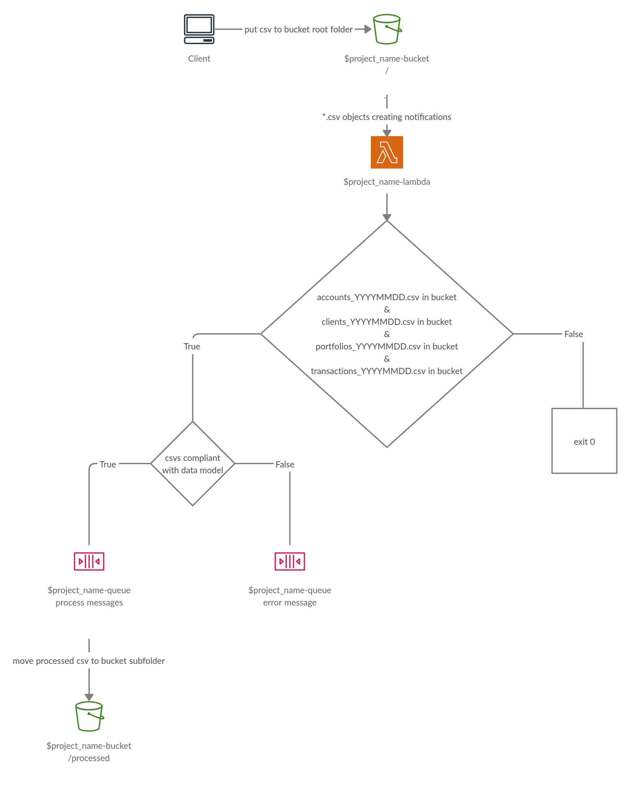
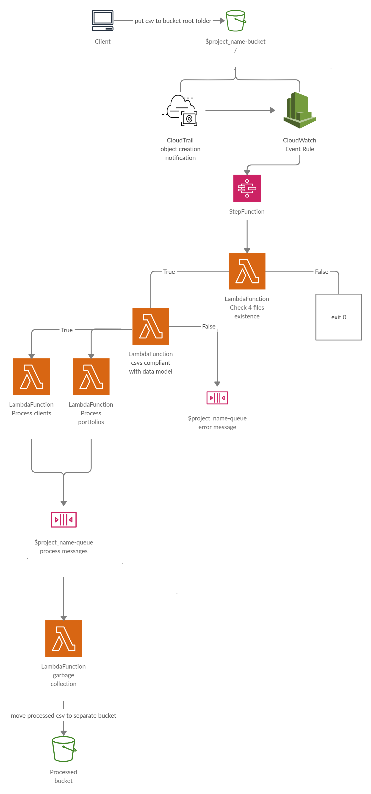

# Install

1. Set unique project name in `terraform.tfvars`
2. Set desired region in `variables.tf`
3. Set AWS credentials in `variables.tf`
4. Run:
   ```
   terraform init
   terraform apply
   ```

# How it works



1. **s3 bucket** generates lambda invocation on each *.csv object creation
2. **lambda function** checks existance of all 4 files with current date
3. **lambda function** checks if files compliants with data model
4. **lambda function** process files, send messages to **sqs** and move processed files to /processed **s3 bucket** subdir


# Possible implimentation

Following implementation is overkill for current task, but may be use in case of business requirements:



1. **s3 bucket** generates events to **CloudTrail**
2. **CloudWatch** parses **CloudTrail** events and invoke **StepFunction** on s3 object creations
3. **StepFunction** starts workflow:
   1. Run lambda function files existance check
   2. Run lambda function data model compliants check
   3. Run two processing lamba functions (send processed data to **sqs**)
   4. Run garbage collection lambda function (move processed files to separate s3 bucket)